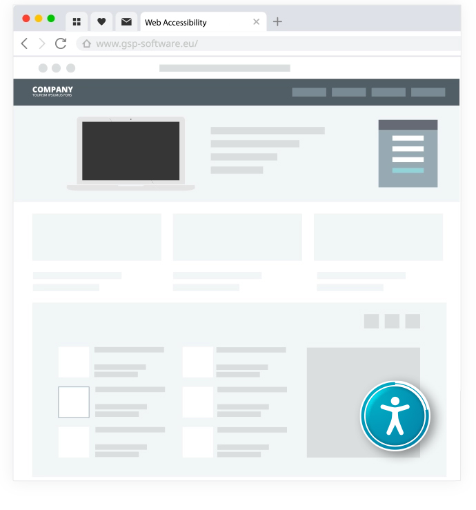
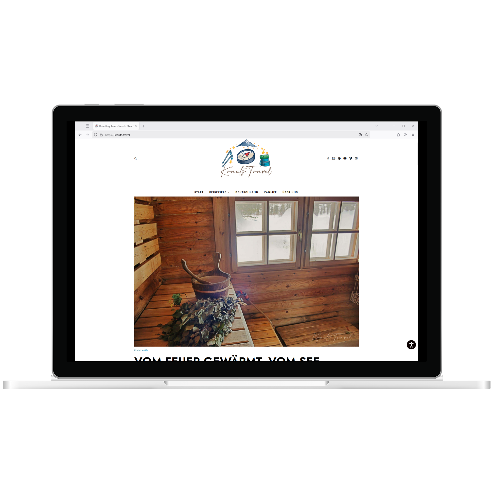
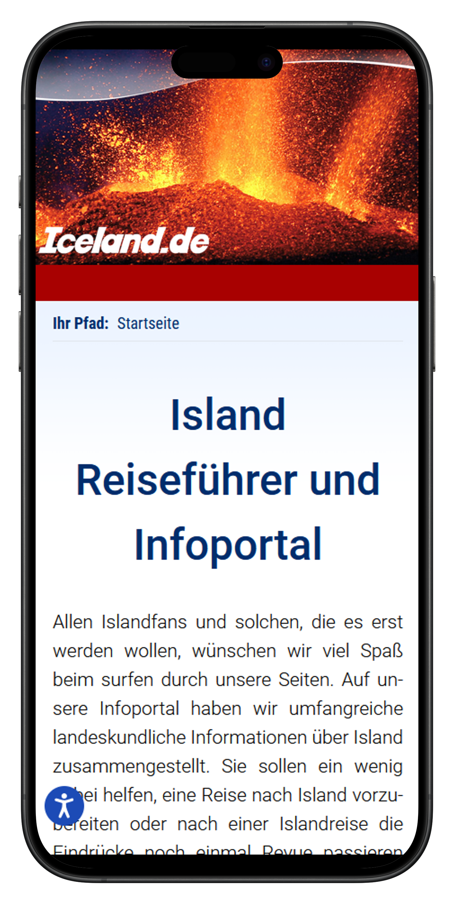
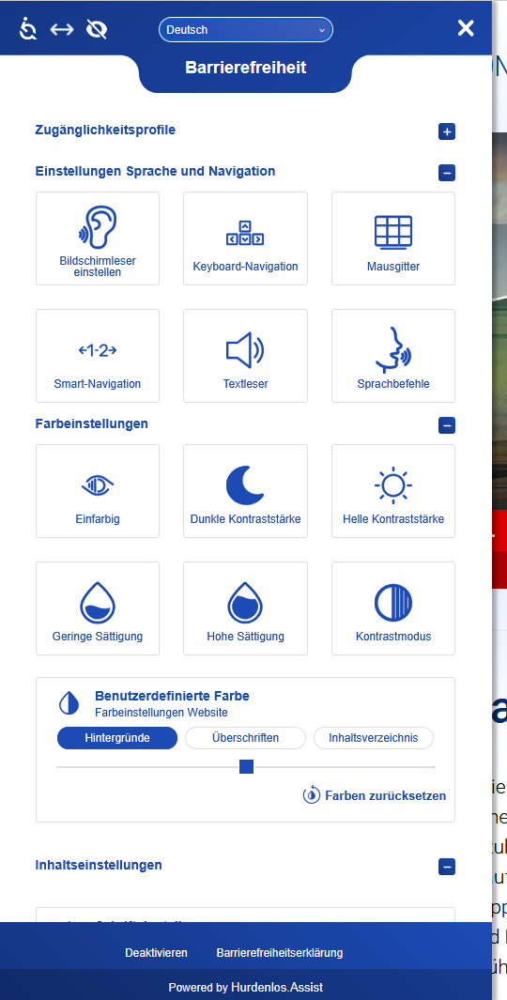
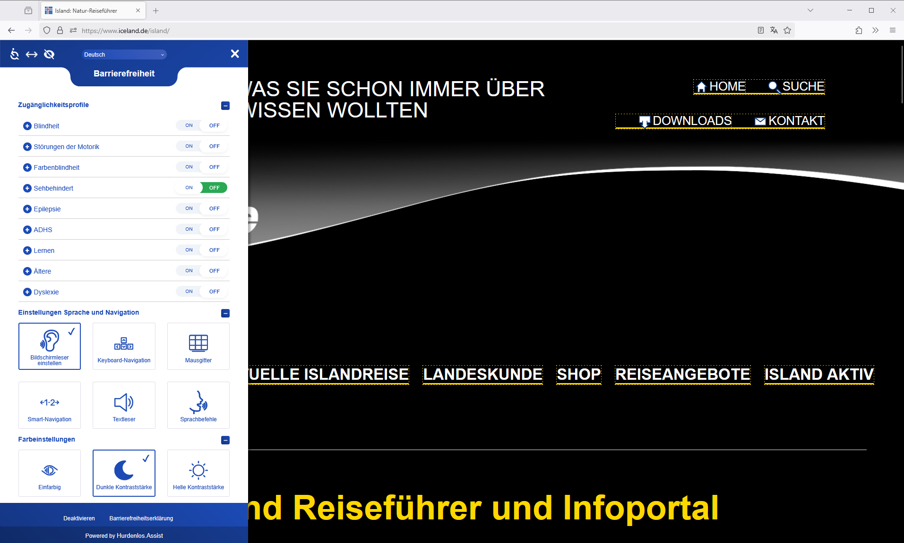
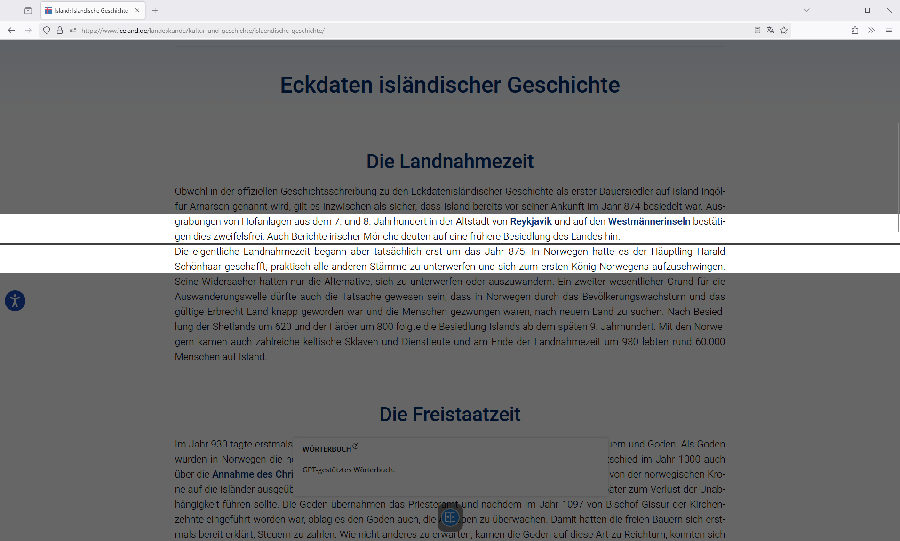

# accessibility 4 typo3

Welcome to the manual of the extension accessibility4typo3.

## Introduction


### What does it do?

In todays digital world, accessibility is not a luxury, its a  necessity. accessibility4typo3  with Huerdenlos.Assist empowers you to make your Typo3 website more  inclusive and welcoming for everyone, regardless of their abilities.  This powerful plugin seamlessly integrates the Huerdenlos.Assist widget  into your website, using smart technology to provide assistance for  users with diabilities. This ensures that your content is easier to  navigate  and interact with for people with disabilities, seniors, and anyone who  benefits from a more user-friendly design.

### Usage

After successfully installing the extension and activating the  widget using the API key, the Huerdenlos.Assist icon appears on the  website. By clicking on the icon, the Huerdenlos.Assist menu opens,  allowing the website visitor to either select or create a profile  tailored to their specific impairment. The widget then uses this profile to optimize the website's display in the browser for the user.


### Why Choose Huerdenlos.Assist?

- Instant Accessibility Boost: Automatically detects and resolves common accessibility barriers after profile activation by user.
- Reach More People: Engage a wider audience by making your website user-friendly for everyone.
- Effortless Integration: Quick setup and activation, no coding skills required.
- Show You Care: Demonstrate your commitment to inclusion and diversity.
- Enhanced User Experience: Offer smoother navigation and better usability for all visitors.


### Screenshots

#### Widget on Website



The Huerdenlos.Assist widget is a small icon on your website.

#### Widget Icon Active on Website



The Huerdenlos.Assist widget icon displayed on the bottom corner of a website.

#### Widget Icon on Mobile Version



The Huerdenlos.Assist widget icon displayed on on a mobile version of a website.

#### Expanded Widget on Website



The expanded Huerdenlos.Assist widget showing accessibility options.

#### Vision-Impaired Profile Active



The widget in action with settings optimized for users with visual impairments (e.g., larger text, higher contrast).

#### ADHD Profile Active



The widget activated with focus-enhancing features for users with ADHD (e.g., simplified content, focus mode).


## Installation

### Installation from TYPO3 Extension Repository (TER)

Go to extension manager in TYPO3 backend, choose "install  extension" and search for accessibility4typo3. Then click on "install".

### Installation using composer

The extension is not availabel in a public repository, but  nevertheless it can be installed using composer. Add a section for a  local istall of packages like this:

```
"repositories": [
	{
		"type": "path",
		"url": "./packages/*/",
		"options": {
		 	"symlink": true
		 }
	}
],
```

Then copy the extension to the /packages directory. Install using

```
composer require gsp/accessibility4typo3:@dev
```

### Include TypoScript

1. Switch to the root page of your site.
2. Switch to the Template module and select *Info/Modify*.
3. Press the link Edit the whole template record and switch to the tab *Advanced Options*.
4. Select GSP accessibility tool at the field *Include TypoScript sets*


## Configuration

### plugin.accessibility4typo3

The values can be changed using the constant editor of TYPO3

#### sitekey

- Type: string
- Default: YOURSITEKEY
- Enter your Licence Sitekey here. Order the sitekey for your domain by email to [info@gsp-software.eu](mailto:info@gsp-software.eu).                     

#### position

- Type: string
- Default: left
- Choose where the widget is displayed on the website. The values can be `left` or `right`                     

### vPosition.desktop

- Type: string
- Default: 50%
- Choose the vertical position where the widget is displayed on the website in desktop view                     

### vPosition.mobile

- Type: string
- Default: 80%
- Choose the vertical position where the widget is displayed on the website in mobile view                     

### color.main

- Type: string
- Default: #1c4bb6
- The main color or the widget                     

### color.second

- Type: string
- Default: #ffffff
- The secondary color or the widget                     


## Frequently Asked Questions

- What is the Huerdenlos.Assist widget and how does it work?

  The Huerdenlos.Assist widget is an accessibility tool that  integrates into your website to enhance usability for all visitors. Upon activation, it utilizes AI to analyze your site's content, identifying  and addressing common accessibility issues. This process begins  immediately, with comprehensive optimizations typically completed within 48 hours. During this period, the AI evaluates your site and implements necessary adjustments to improve accessibility.

- How long does it take for the widget to optimize my website?

  After successful integration, the Huerdenlos.Assist widget  appears on your website and begins the accessibility enhancement  process. While some improvements are immediate, full optimization is  usually achieved within 48 hours, allowing the AI sufficient time to  thoroughly analyze and adjust your site's content.

- Is Huerdenlos.Assist compliant with accessibility standards like WCAG?

  The plugin follows the principles of the Web Content  Accessibility Guidelines (WCAG) to improve website accessibility. Simply using the widget does NOT automatically meet the legal requirements for accessibility. The widget provides additional support for visitors with certain disabilities and also makes it clear that inclusion is an  important issue for the website owner.

- Do I need technical skills to use this plugin?

  No - once activated and the API key is entered, the plugin works automatically?no coding required.

- How do I get the API key?

  You can purchase the API key directly at https://www.gsp-software.eu/hurdenlosassist

- What happens if I don?t enter an API key?

  Without a valid API key, the widget will not function. Please ensure you enter the correct key.

- Does the widget support multiple languages?

  Yes, the Huerdenlos.Assist widget supports multiple  languages, enhancing accessibility for a diverse audience. Users can  select their preferred language directly from the widget's interface.

- Will the changes made by the widget be saved for future visits?

  Yes, the accessibility adjustments made by the  Huerdenlos.Assist widget are saved using cookies, ensuring a consistent  and optimized experience for returning visitors. User preferences are  also retained to maintain personalized accessibility settings.

- What happens if the widget cannot address all accessibility issues?

  While the Huerdenlos.Assist widget addresses many common  accessibility issues, some complex challenges may require manual  intervention. In such cases, our team can perform a manual audit and  provide recommendations for fixing issues within your website's source  code.

- Does integrating the widget affect my website's performance?

  The Huerdenlos.Assist widget is designed to have a minimal  impact on your website's performance. It operates efficiently to ensure  that accessibility enhancements do not compromise loading times or  overall site functionality.


## Known problems

Currently the parameter plugin.accessibility4typo3.position left/right has no effect.

​                

- [Home](https://gsp-software.eu/hurdenlosassist/)
- [Issues](https://github.com/gsp-software/accessibility4typo3/issues)
- [Repository](https://github.com/gsp-software/accessibility4typo3)

​       

- [Legal Notice](https://typo3.org/legal-notice)
- [Privacy Policy](https://typo3.org/privacy-policy)